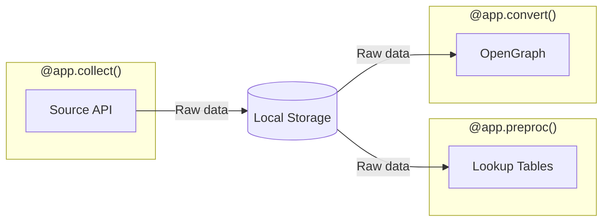

# Decorators

OpenHound provides several decorators to simplify the development of collection pipeline. Each decorator dynamically
registers a CLI command and defines specific stages as part of the collection workflow. The collection decorators wrap
functions that interact with [DLT](https://dlthub.com/docs/intro) (Data Load Tool) to extract and transform data into
the OpenGraph format.

## Initialization

A collector is initialized with the `OpenHound` class, which provides decorators for each pipeline stage. The first
argument is the name of your collector with an additional help/description. The name provided will also register a CLI
command with the same name, ie. `OpenHound("aws")` will expose an `openhound collect aws` command.

```python
from openhound import OpenHound

app = OpenHound("aws", help="OpenHound collector for AWS")
```

## Decorators

### @app.collect()

Registers a CLI command that collects resources from the source system and stores them in the original (optionally
filtered) format on disk. This function should return your DLT [source](collection.md).

```python
@app.collect()
def collect(ctx: CollectContext):
    from openhound_aws.source import source as aws_source
    return aws_source()
```

**Parameters:**

- `ctx` (CollectContext): Pipeline context for the resource collection stage.

### @app.preproc()

Registers a CLI command that (optionally) preprocesses collected resources and builds lookup data for the OpenGraph
conversion stage. This function should return a dictionary mapping resource names to table names.

Optionally, you can provide a `transformer` function that applies Ibis-based transformations to the loaded data in
DuckDB. The transformer function receives a DuckDB connection and can create new tables derived from the loaded
resources.

In the example below, the AWS `users` resource will be stored in the `users` table, `groups` in the `groups` table. The
transformer function is imported from a separate `transforms` module and applies custom SQL/Ibis transformations (
optional).

```python
from openhound_aws.transforms import transforms


@app.preproc(transformer=transforms)
def preproc(ctx: PreProcContext):
    resources = {
        "resources": "resources",
        "users": "users",
        "groups": "groups",
        "roles": "roles",
        "policies": "policies",
        "policy_attachments": "policy_attachments",
    }
    return resources
```

**Parameters:**

- `ctx` (PreProcContext): Pipeline context for the preprocessing stage.
- `transformer` (Callable, optional): Optional function that takes a DuckDB connection and applies transformations to
  create custom tables.

### @app.convert()

Registers a CLI command that converts collected resources into OpenGraph nodes and edges. This function should return a
tuple containing the DLT source and a dictionary of extra context to be added to each asset.

```python
@app.convert(lookup=AWSLookup)
def convert(ctx: ConvertContext) -> Tuple[DltSource, dict]:
    from openhound_aws.source import source as aws_source
    extras = {}
    return aws_source(), extras
```

**Parameters:**

- `lookup`: An optional lookup class for resolving resources during OpenGraph conversion.
- `ctx` (ConvertContext): Pipeline context for the OpenGraph conversion stage.

### @app.icons()

Registers a CLI command that synchronizes custom icons with BloodHound. This function should return a dictionary mapping
the primary node kind to the icon name. The example below includes the icons as a dictionary, though these can also be
read from a configuration file.

```python
@app.icons(color="#EE7D0C")
def icons():
    return {
        "AWSUser": "user",
        "AWSGroup": "user-group",
        "AWSRole": "id-badge",
        "AWSInlinePolicy": "file-contract",
        "AWSPolicy": "file-contract",
    }
```

**Parameters:**

- `color`: The default color for the custom icons

## Pipeline Flow


