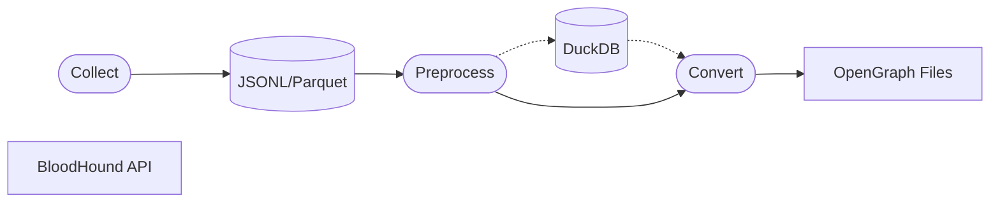

# OpenHound

OpenHound is a standardized framework for building OpenGraph collectors and converters. Built
on [DLT](https://dlthub.com/docs/intro) (Data Load Tool), it provides a
consistent workflow for collecting, processing, and converting data from any source into BloodHound-compatible graphs.
OpenHound enforces a collect-first, convert-later pipeline. Raw data collected from a source is always stored before
transformation and ensures reproducibility. Custom decorators simplify collector development with minimal boilerplate,
while CLI commands and graph documentation are automatically generated for every source.

## How it works

**Collect**:
OpenHound uses DLT to collect resources from various services. Resources are parsed using a Pydantic model and stored as
JSONL/Parquet on disk during the collection phase.

**Pre-process**:
A DuckDB database can be (optionally) populated to store resources for OpenGraph conversion. The database can be used as
a lookup to find, for example, all resources a particular user/group has permissions to.

**Convert**:
The raw resources are read from disk and converted to OpenGraph nodes and edges. The generated local OpenGraph JSON
files are automatically split into multiple files based on your configured (entry)
size limit and resource type.

# DLT (Data Load Tool)

DLT Is an open-source Python library to load data from various data sources into well-structured datasets. The dlt
library solves a lot of the issues faced when building a custom data collector for BloodHound. DLT includes features
like:

- Schema validation: Automatically catch potential data formatting issues from your source and before exporting your
  graph;
- Incremental loading: Only process what has changed since your last run;
- Pre-built connectors: Already contains pre-built connectors and an easy to use (generic) HTTP connector which deals
  with pagination automatically 💫;
- Multi-processing: Parallelize resource collection;
- Config management: Simple configuration management for your custom sources, which are read from both environment
  variables and/or centralized config files;

## Supported sources (current state)

- Kubernetes: Collects all resource types (including CRDs) with additional enrichment for commonly used objects like
  pods, service accounts, roles, and secrets;
- AWS: Primarily collects IAM users, groups, roles and policies. Additionally discovers resources via AWS Resource
  Explorer;
- Rapid7 InsightVM: Collects assets and discovered vulnerabilities. Each vulnerability will be transformed into its own
  node and automatically linked to existing BloodHound assets by matching hostnames;
- BloodHound: BloodHound itself is also a source. By collecting all BloodHound nodes and storing them in our embedded
  DuckDB database, the collectors can efficiently query and reference any pre-existing node by any of its properties.
  This is also how the Rapid7 InsightVM source matches vulnerabilities to assets, and how you can potentially link other
  external identities to existing AD users without having to query the BloodHound API every time.

## Supported destinations

- File Export: Generates local OpenGraph JSON files which are automatically split into multiple files based on your
  configured (entry) size limit and resource type. This can be useful if you want to review the data before ingestion,
  want to share graphs, or don’t have access to the BloodHound API at the time;
- Direct API: Generates the same OpenGraph format but uploads the content via the BloodHound API without the storing
  files on disk first.
