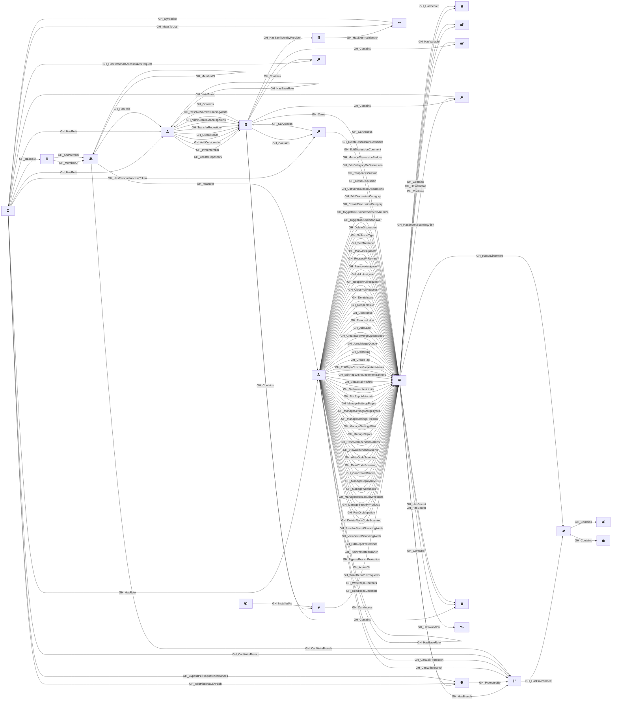

# Overview

This page documents the `github` OpenHound source, including its architecture, resource relationships and exported OpenGraph assets. The source extracts data from github and transforms it into the standardized OpenGraph format. Use the visual diagram below to understand how nodes relate to each other, then explore the exported DLT [resources](resources.md) and invidual assets.

## Visual overview
The diagram below shows the relationships between OpenGraph nodes and assets that are part of the github source. This diagram is automatically generated by each resource/asset that is wrapped with the `@app.asset` decorator.

## Node Icons
The following table shows the Font Awesome icon used for each node type in the visual diagram above:

| Node Type | Icon | Font Awesome Class |
|------|-----------|-------------------|
| GH_RepoSecret | :fontawesome-solid-lock: | `fa-lock` |
| GH_User | :fontawesome-solid-user: | `fa-user` |
| GH_RepoVariable | :fontawesome-solid-lock-open: | `fa-lock-open` |
| GH_OrgVariable | :fontawesome-solid-lock-open: | `fa-lock-open` |
| GH_SecretScanningAlert | :fontawesome-solid-key: | `fa-key` |
| GH_Organization | :fontawesome-solid-building: | `fa-building` |
| GH_PersonalAccessToken | :fontawesome-solid-key: | `fa-key` |
| GH_OrgRole | :fontawesome-solid-user-tie: | `fa-user-tie` |
| GH_EnvironmentVariable | :fontawesome-solid-lock-open: | `fa-lock-open` |
| GH_BranchProtectionRule | :fontawesome-solid-shield: | `fa-shield` |
| GH_AppInstallation | :fontawesome-solid-plug: | `fa-plug` |
| GH_App | :fontawesome-solid-cube: | `fa-cube` |
| GH_OrgSecret | :fontawesome-solid-lock: | `fa-lock` |
| GH_Branch | :fontawesome-solid-code-branch: | `fa-code-branch` |
| GH_Team | :fontawesome-solid-user-group: | `fa-user-group` |
| GH_ExternalIdentity | :fontawesome-solid-arrows-left-right: | `fa-arrows-left-right` |
| GH_SamlIdentityProvider | :fontawesome-solid-id-badge: | `fa-id-badge` |
| GH_RepoRole | :fontawesome-solid-user-tie: | `fa-user-tie` |
| GH_PersonalAccessTokenRequest | :fontawesome-solid-key: | `fa-key` |
| GH_Environment | :fontawesome-solid-leaf: | `fa-leaf` |
| GH_Workflow | :fontawesome-solid-cogs: | `fa-cogs` |
| GH_Repository | :fontawesome-solid-box-archive: | `fa-box-archive` |
| GH_TeamRole | :fontawesome-solid-user-tie: | `fa-user-tie` |
| GH_EnvironmentSecret | :fontawesome-solid-lock: | `fa-lock` |

## Exported OpenGraph assets

The following table lists all OpenGraph assets produced by the github source. Each asset represents a node or edge as part of the OpenGraph output.

| Class | Description | Node | Edges |
|------|-------------|-------|-------|
|[RepoSecret](assets/RepoSecret.md) |  | GH_RepoSecret | 2 |
|[TeamMember](assets/TeamMember.md) |  |  | 1 |
|[User](assets/User.md) |  | GH_User | 1 |
|[RepoVariable](assets/RepoVariable.md) |  | GH_RepoVariable | 2 |
|[OrgVariable](assets/OrgVariable.md) |  | GH_OrgVariable | 1 |
|[SelectedOrgVariable](assets/SelectedOrgVariable.md) |  |  | 1 |
|[SecretScanningAlert](assets/SecretScanningAlert.md) |  | GH_SecretScanningAlert | 3 |
|[Organization](assets/Organization.md) |  | GH_Organization | 0 |
|[PersonalAccessToken](assets/PersonalAccessToken.md) |  | GH_PersonalAccessToken | 3 |
|[OrgRole](assets/OrgRole.md) |  | GH_OrgRole | 9 |
|[EnvironmentVariable](assets/EnvironmentVariable.md) |  | GH_EnvironmentVariable | 1 |
|[BranchProtectionRule](assets/BranchProtectionRule.md) |  | GH_BranchProtectionRule | 1 |
|[AppInstallation](assets/AppInstallation.md) |  | GH_AppInstallation | 2 |
|[App](assets/App.md) |  | GH_App | 0 |
|[AppInstallationRepoAccess](assets/AppInstallationRepoAccess.md) |  |  | 1 |
|[OrgSecret](assets/OrgSecret.md) |  | GH_OrgSecret | 2 |
|[SelectedOrgSecret](assets/SelectedOrgSecret.md) |  |  | 1 |
|[OrgRoleMember](assets/OrgRoleMember.md) |  |  | 1 |
|[EnvironmentBranchPolicy](assets/EnvironmentBranchPolicy.md) |  |  | 1 |
|[Branch](assets/Branch.md) |  | GH_Branch | 2 |
|[OrgRoleTeam](assets/OrgRoleTeam.md) |  |  | 1 |
|[Team](assets/Team.md) |  | GH_Team | 1 |
|[ExternalIdentity](assets/ExternalIdentity.md) |  | GH_ExternalIdentity | 3 |
|[SamlProvider](assets/SamlProvider.md) |  | GH_SamlIdentityProvider | 1 |
|[RepoRole](assets/RepoRole.md) |  | GH_RepoRole | 62 |
|[RepoRoleAssignment](assets/RepoRoleAssignment.md) |  |  | 4 |
|[PersonalAccessTokenRequest](assets/PersonalAccessTokenRequest.md) |  | GH_PersonalAccessTokenRequest | 2 |
|[Environment](assets/Environment.md) |  | GH_Environment | 1 |
|[PatRepoAccess](assets/PatRepoAccess.md) |  |  | 1 |
|[Workflow](assets/Workflow.md) |  | GH_Workflow | 1 |
|[Repository](assets/Repository.md) |  | GH_Repository | 1 |
|[BranchPushAllowance](assets/BranchPushAllowance.md) |  |  | 1 |
|[TeamRole](assets/TeamRole.md) |  | GH_TeamRole | 2 |
|[EnvironmentSecret](assets/EnvironmentSecret.md) |  | GH_EnvironmentSecret | 1 |
|[BranchPrBypassAllowance](assets/BranchPrBypassAllowance.md) |  |  | 1 |

**Next Steps:**

- Explore individual github [resources](pipeline.md) to see what data / API endpoints are used for extraction.
- Review asset schemas for detailed field information for each individual resource.