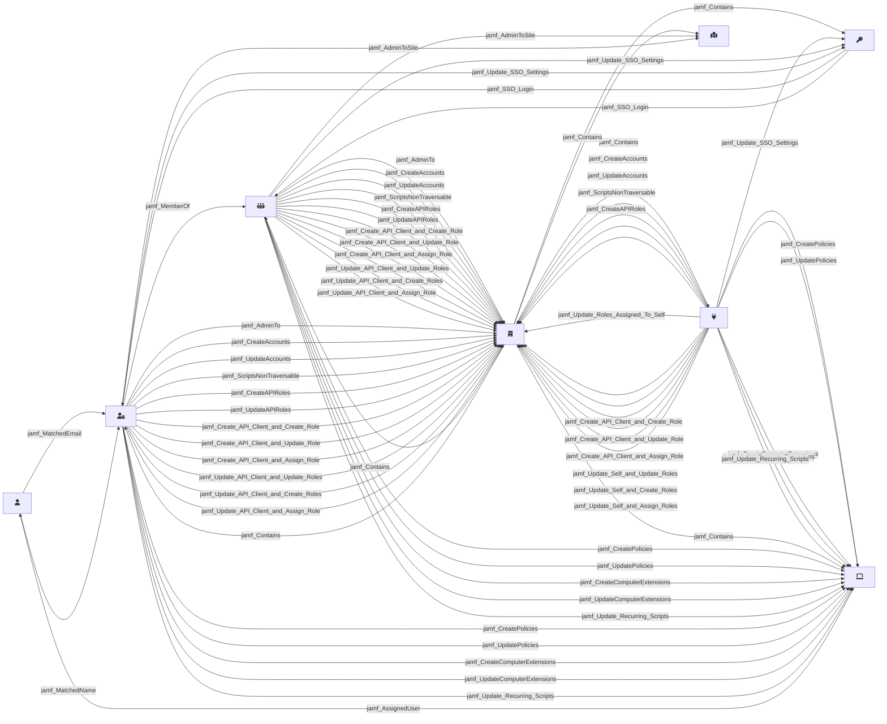

# Overview

This page documents the `jamf` OpenHound source, including its architecture, resource relationships and exported OpenGraph assets. The source extracts data from jamf and transforms it into the standardized OpenGraph format. Use the visual diagram below to understand how nodes relate to each other, then explore the exported DLT [resources](pipeline.md) and invidual assets.

## Visual overview
The diagram below shows the relationships between OpenGraph nodes and assets that are part of the jamf source. This diagram is automatically generated by each resource/asset that is wrapped with the `@app.asset` decorator.

## Node Icons
The following table shows the Font Awesome icon used for each node type in the visual diagram above:

| Node Type | Icon | Font Awesome Class |
|------|-----------|-------------------|
| jamf_ComputerUser | :fontawesome-solid-user: | `fa-user` |
| jamf_Tenant | :fontawesome-solid-building: | `fa-building` |
| jamf_SSOIntegration | :fontawesome-solid-key: | `fa-key` |
| jamf_ApiClient | :fontawesome-solid-plug: | `fa-plug` |
| jamf_Computer | :fontawesome-solid-laptop: | `fa-laptop` |
| jamf_Site | :fontawesome-solid-map-location: | `fa-map-location` |
| jamf_Group | :fontawesome-solid-people-group: | `fa-people-group` |
| jamf_Account | :fontawesome-solid-user-lock: | `fa-user-lock` |

## Exported OpenGraph assets

The following table lists all OpenGraph assets produced by the jamf source. Each asset represents a node or edge as part of the OpenGraph output.

| Class | Description | Node | Edges |
|------|-------------|-------|-------|
|[User](assets/User.md) | Jamf User asset. Returns a node representing a Jamf User and edges to assigned computers. | jamf_ComputerUser | 3 |
|[Tenant](assets/Tenant.md) | Jamf Tenant asset. Returns a node representing a Jamf Tenant with no edges. | jamf_Tenant | 0 |
|[SSO](assets/SSO.md) | Jamf SSO asset. Returns a node representing the SSO configuration for JAMF. | jamf_SSOIntegration | 3 |
|[ApiRole](assets/ApiRole.md) | Jamf API Role asset. Returns a node representing a Jamf API Role with edges to its tenant. |  | 0 |
|[ApiIntegration](assets/ApiIntegration.md) | Jamf API Client asset. Returns a node representing a Jamf API Client with edges to its tenant. | jamf_ApiClient | 18 |
|[Policy](assets/Policy.md) | Jamf Policy asset. Returns a node representing a Jamf Policy and edges to its tenant. |  | 0 |
|[Computer](assets/Computer.md) |  | jamf_Computer | 1 |
|[Site](assets/Site.md) | Jamf Site asset. Returns a node representing a Jamf Site and edges to its tenant. | jamf_Site | 1 |
|[Group](assets/Group.md) | Jamf Group asset. Returns a node representing a Jamf Group and edges to its members. | jamf_Group | 21 |
|[Script](assets/Script.md) | Jamf Script asset. Returns a node representing a Jamf Script and edges to its tenant. |  | 0 |
|[Account](assets/Account.md) | Jamf Account asset. Returns a node representing a Jamf Account and its privilege edges. | jamf_Account | 20 |

**Next Steps:**

- Explore individual jamf [resources](pipeline.md) to see what data / API endpoints are used for extraction.
- Review asset schemas for detailed field information for each individual resource.