# Overview

This page documents the `okta` OpenHound source, including its architecture, resource relationships and exported OpenGraph assets. The source extracts data from okta and transforms it into the standardized OpenGraph format. Use the visual diagram below to understand how nodes relate to each other, then explore the exported DLT [resources](pipeline.md) and invidual assets.

## Visual overview
The diagram below shows the relationships between OpenGraph nodes and assets that are part of the okta source. This diagram is automatically generated by each resource/asset that is wrapped with the `@app.asset` decorator.

```mermaid
flowchart LR

    Okta_JWK["fa:fa-key"]:::bhNode

    Okta_User["fa:fa-user"]:::bhNode

    Okta_ApiServiceIntegration["fa:fa-robot"]:::bhNode

    Okta_IdentityProvider["fa:fa-right-to-bracket"]:::bhNode

    Okta_ClientSecret["fa:fa-key"]:::bhNode

    Okta_AgentPool["fa:fa-gears"]:::bhNode

    Okta_Device["fa:fa-mobile"]:::bhNode

    Okta_RoleAssignment["fa:fa-clipboard-check"]:::bhNode

    Okta_Organization["fa:fa-globe"]:::bhNode

    Okta_RoleAssignment["fa:fa-clipboard-check"]:::bhNode

    Okta_ApiToken["fa:fa-key"]:::bhNode

    Okta_Role["fa:fa-clipboard-list"]:::bhNode

    Okta_Policy["fa:fa-shield"]:::bhNode

    Okta_AuthorizationServer["fa:fa-certificate"]:::bhNode

    Okta_CustomRole["fa:fa-clipboard-list"]:::bhNode

    Okta_RoleAssignment["fa:fa-clipboard-check"]:::bhNode

    Okta_Application["fa:fa-window-maximize"]:::bhNode

    Okta_ResourceSet["fa:fa-folder"]:::bhNode

    Okta_Agent["fa:fa-gear"]:::bhNode

    Okta_Group["fa:fa-users"]:::bhNode

    Okta_Realm["fa:fa-building"]:::bhNode

    Okta_Application -- Okta_GroupPush --> Okta_Group
    Okta_JWK -- Okta_KeyOf --> Okta_Application
    Okta_Policy -- Okta_PolicyMapping --> Okta_Application
    Okta_Organization -- Okta_Contains --> Okta_User
    Okta_Realm -- Okta_RealmContains --> Okta_User
    Okta_User -- Okta_ManagerOf --> Okta_User
    Okta_Organization -- Okta_Contains --> Okta_ApiServiceIntegration
    Okta_User -- Okta_CreatorOf --> Okta_ApiServiceIntegration
    Okta_Organization -- Okta_Contains --> Okta_IdentityProvider
    Okta_IdentityProvider -- Okta_IdpGroupAssignment --> Okta_Group
    Okta_Organization -- Okta_InboundOrgSSO --> Okta_IdentityProvider
    Okta_ClientSecret -- Okta_SecretOf --> Okta_Application
    Okta_Organization -- Okta_Contains --> Okta_AgentPool
    Okta_AgentPool -- Okta_AgentPoolFor --> Okta_Agent
    Okta_Organization -- Okta_Contains --> Okta_Device
    Okta_Device -- Okta_DeviceOf --> Okta_User
    Okta_Application -- Okta_HasRoleAssignment --> Okta_RoleAssignment
    Okta_Application -- Okta_HasRole --> Okta_Role
    Okta_Application -- Okta_HasRole --> Okta_CustomRole
    Okta_Application -- Okta_AddMember --> Okta_Group
    Okta_Application -- Okta_AppAdmin --> Okta_Application
    Okta_Application -- Okta_GroupMembershipAdmin --> Okta_Group
    Okta_Application -- Okta_GroupAdmin --> Okta_User
    Okta_Application -- Okta_GroupAdmin --> Okta_Group
    Okta_Application -- Okta_HelpDeskAdmin --> Okta_User
    Okta_Application -- Okta_MobileAdmin --> Okta_Device
    Okta_Application -- Okta_OrgAdmin --> Okta_User
    Okta_Application -- Okta_OrgAdmin --> Okta_Group
    Okta_Application -- Okta_OrgAdmin --> Okta_Device
    Okta_Application -- Okta_SuperAdmin --> Okta_Organization
    Okta_Application -- Okta_GroupAdmin --> Okta_Group
    Okta_Application -- Okta_GroupAdmin --> Okta_User
    Okta_Application -- Okta_ScopedTo --> Okta_Group
    Okta_Application -- Okta_ScopedTo --> Okta_Organization
    Okta_Application -- Okta_ScopedTo --> Okta_Application
    Okta_Group -- Okta_AppAssignment --> Okta_Application
    Okta_Group -- Okta_HasRoleAssignment --> Okta_RoleAssignment
    Okta_Group -- Okta_HasRole --> Okta_Role
    Okta_Group -- Okta_HasRole --> Okta_CustomRole
    Okta_Group -- Okta_AddMember --> Okta_Group
    Okta_Group -- Okta_GroupAdmin --> Okta_User
    Okta_Group -- Okta_GroupAdmin --> Okta_Group
    Okta_Group -- Okta_AppAdmin --> Okta_Application
    Okta_Group -- Okta_GroupMembershipAdmin --> Okta_Group
    Okta_Group -- Okta_HelpDeskAdmin --> Okta_User
    Okta_Group -- Okta_MobileAdmin --> Okta_Device
    Okta_Group -- Okta_OrgAdmin --> Okta_User
    Okta_Group -- Okta_OrgAdmin --> Okta_Group
    Okta_Group -- Okta_OrgAdmin --> Okta_Device
    Okta_Group -- Okta_SuperAdmin --> Okta_Organization
    Okta_Group -- Okta_GroupAdmin --> Okta_Group
    Okta_Group -- Okta_GroupAdmin --> Okta_User
    Okta_Group -- Okta_ScopedTo --> Okta_Group
    Okta_Group -- Okta_ScopedTo --> Okta_Organization
    Okta_Group -- Okta_ScopedTo --> Okta_Application
    Okta_ApiToken -- Okta_ApiTokenFor --> Okta_User
    Okta_Organization -- Okta_Contains --> Okta_Role
    Okta_Organization -- Okta_Contains --> Okta_Policy
    Okta_Organization -- Okta_Contains --> Okta_AuthorizationServer
    Okta_ResourceSet -- Okta_Contains --> Okta_User
    Okta_ResourceSet -- Okta_Contains --> Okta_Group
    Okta_ResourceSet -- Okta_Contains --> Okta_Application
    Okta_ResourceSet -- Okta_Contains --> Okta_ApiServiceIntegration
    Okta_ResourceSet -- Okta_Contains --> Okta_Device
    Okta_ResourceSet -- Okta_Contains --> Okta_AuthorizationServer
    Okta_ResourceSet -- Okta_Contains --> Okta_IdentityProvider
    Okta_ResourceSet -- Okta_Contains --> Okta_Policy
    Okta_Organization -- Okta_Contains --> Okta_CustomRole
    Okta_User -- Okta_AppAssignment --> Okta_Application
    Okta_Application -- Okta_UserPull --> Okta_User
    Okta_User -- Okta_UserPush --> Okta_Application
    Okta_User -- Okta_UserSync --> User
    User -- Okta_UserSync --> Okta_User
    User -- Okta_PasswordSync --> Okta_User
    Okta_User -- Okta_PasswordSync --> Okta_User
    Okta_User -- Okta_HasRoleAssignment --> Okta_RoleAssignment
    Okta_Group -- Okta_HasRoleAssignment --> Okta_RoleAssignment
    Okta_User -- Okta_HasRole --> Okta_Role
    Okta_Group -- Okta_HasRole --> Okta_Role
    Okta_User -- Okta_HasRole --> Okta_CustomRole
    Okta_Group -- Okta_HasRole --> Okta_CustomRole
    Okta_Group -- Okta_AddMember --> Okta_Group
    Okta_User -- Okta_AddMember --> Okta_Group
    Okta_Application -- Okta_AddMember --> Okta_Group
    Okta_Group -- Okta_GroupAdmin --> Okta_User
    Okta_User -- Okta_GroupAdmin --> Okta_User
    Okta_Application -- Okta_GroupAdmin --> Okta_User
    Okta_Group -- Okta_GroupAdmin --> Okta_Group
    Okta_User -- Okta_GroupAdmin --> Okta_Group
    Okta_Application -- Okta_GroupAdmin --> Okta_Group
    Okta_Group -- Okta_AppAdmin --> Okta_Application
    Okta_User -- Okta_AppAdmin --> Okta_Application
    Okta_Application -- Okta_AppAdmin --> Okta_Application
    Okta_Group -- Okta_GroupMembershipAdmin --> Okta_Group
    Okta_User -- Okta_GroupMembershipAdmin --> Okta_Group
    Okta_Application -- Okta_GroupMembershipAdmin --> Okta_Group
    Okta_Group -- Okta_HelpDeskAdmin --> Okta_User
    Okta_User -- Okta_HelpDeskAdmin --> Okta_User
    Okta_Application -- Okta_HelpDeskAdmin --> Okta_User
    Okta_Group -- Okta_MobileAdmin --> Okta_Device
    Okta_User -- Okta_MobileAdmin --> Okta_Device
    Okta_Application -- Okta_MobileAdmin --> Okta_Device
    Okta_User -- Okta_OrgAdmin --> Okta_User
    Okta_User -- Okta_OrgAdmin --> Okta_Group
    Okta_User -- Okta_OrgAdmin --> Okta_Device
    Okta_Group -- Okta_OrgAdmin --> Okta_User
    Okta_Group -- Okta_OrgAdmin --> Okta_Group
    Okta_Group -- Okta_OrgAdmin --> Okta_Device
    Okta_Application -- Okta_OrgAdmin --> Okta_User
    Okta_Application -- Okta_OrgAdmin --> Okta_Group
    Okta_Application -- Okta_OrgAdmin --> Okta_Device
    Okta_User -- Okta_SuperAdmin --> Okta_Organization
    Okta_Group -- Okta_SuperAdmin --> Okta_Organization
    Okta_Application -- Okta_SuperAdmin --> Okta_Organization
    Okta_User -- Okta_GroupAdmin --> Okta_Group
    Okta_User -- Okta_GroupAdmin --> Okta_User
    Okta_User -- Okta_ScopedTo --> Okta_Group
    Okta_User -- Okta_ScopedTo --> Okta_Organization
    Okta_User -- Okta_ScopedTo --> Okta_Application
    Okta_Organization -- Okta_Contains --> Okta_Application
    Okta_IdentityProvider -- Okta_IdentityProviderFor --> Okta_User
    Okta_Organization -- Okta_InboundSSO --> Okta_User
    Okta_Organization -- Okta_Contains --> Okta_ResourceSet
    Okta_Agent -- Okta_AgentMemberOf --> Okta_AgentPool
    User -- Okta_HostsAgent --> Okta_Agent
    Okta_Organization -- Okta_Contains --> Okta_Group
    Okta_Application -- Okta_GroupPull --> Okta_Group
    Okta_Group -- Okta_MembershipSync --> Okta_Group
    Group -- Okta_MembershipSync --> Okta_Group
    Okta_Organization -- Okta_Contains --> Okta_Realm
    Okta_User -- Okta_MemberOf --> Okta_Group
```

## Node Icons
The following table shows the Font Awesome icon used for each node type in the visual diagram above:

| Node Type | Icon | Font Awesome Class |
|------|-----------|-------------------|
| Okta_JWK | :fontawesome-solid-key: | `fa-key` |
| Okta_User | :fontawesome-solid-user: | `fa-user` |
| Okta_ApiServiceIntegration | :fontawesome-solid-robot: | `fa-robot` |
| Okta_IdentityProvider | :fontawesome-solid-right-to-bracket: | `fa-right-to-bracket` |
| Okta_ClientSecret | :fontawesome-solid-key: | `fa-key` |
| Okta_AgentPool | :fontawesome-solid-gears: | `fa-gears` |
| Okta_Device | :fontawesome-solid-mobile: | `fa-mobile` |
| Okta_RoleAssignment | :fontawesome-solid-clipboard-check: | `fa-clipboard-check` |
| Okta_Organization | :fontawesome-solid-globe: | `fa-globe` |
| Okta_RoleAssignment | :fontawesome-solid-clipboard-check: | `fa-clipboard-check` |
| Okta_ApiToken | :fontawesome-solid-key: | `fa-key` |
| Okta_Role | :fontawesome-solid-clipboard-list: | `fa-clipboard-list` |
| Okta_Policy | :fontawesome-solid-shield: | `fa-shield` |
| Okta_AuthorizationServer | :fontawesome-solid-certificate: | `fa-certificate` |
| Okta_CustomRole | :fontawesome-solid-clipboard-list: | `fa-clipboard-list` |
| Okta_RoleAssignment | :fontawesome-solid-clipboard-check: | `fa-clipboard-check` |
| Okta_Application | :fontawesome-solid-window-maximize: | `fa-window-maximize` |
| Okta_ResourceSet | :fontawesome-solid-folder: | `fa-folder` |
| Okta_Agent | :fontawesome-solid-gear: | `fa-gear` |
| Okta_Group | :fontawesome-solid-users: | `fa-users` |
| Okta_Realm | :fontawesome-solid-building: | `fa-building` |

## Exported OpenGraph assets

The following table lists all OpenGraph assets produced by the okta source. Each asset represents a node or edge as part of the OpenGraph output.

| Class | Description | Node | Edges |
|------|-------------|-------|-------|
|[ApplicationGroupMapping](assets/ApplicationGroupMapping.md) | Okta application group mappings (push) |  | 1 |
|[ApplicationJWKS](assets/ApplicationJWKS.md) | Okta application JSON Web Keys | Okta_JWK | 1 |
|[PolicyMapping](assets/PolicyMapping.md) | Okta policy asset mapping |  | 1 |
|[User](assets/User.md) | Okta user asset | Okta_User | 3 |
|[ApiService](assets/ApiService.md) | Okta API service integration asset | Okta_ApiServiceIntegration | 2 |
|[IdentityProvider](assets/IdentityProvider.md) | Okta identity provider asset | Okta_IdentityProvider | 3 |
|[ApplicationSecrets](assets/ApplicationSecrets.md) | Okta application client secrets | Okta_ClientSecret | 1 |
|[AgentPool](assets/AgentPool.md) | Okta agent pool asset | Okta_AgentPool | 2 |
|[Device](assets/Device.md) | Okta device asset | Okta_Device | 2 |
|[ClientRoleAssignment](assets/ClientRoleAssignment.md) | Okta client (application) role assignment | Okta_RoleAssignment | 19 |
|[Organization](assets/Organization.md) | Okta organization asset | Okta_Organization | 0 |
|[GroupAssignedApp](assets/GroupAssignedApp.md) | Okta assigned application asset |  | 1 |
|[GroupRoleAssignment](assets/GroupRoleAssignment.md) | Okta group role assignment | Okta_RoleAssignment | 19 |
|[ApiToken](assets/ApiToken.md) | Okta API token asset | Okta_ApiToken | 1 |
|[BuiltInRole](assets/BuiltInRole.md) | Okta built-in role asset | Okta_Role | 1 |
|[Policy](assets/Policy.md) | Okta policy asset | Okta_Policy | 1 |
|[AuthServer](assets/AuthServer.md) | Okta authorization server asset | Okta_AuthorizationServer | 1 |
|[Resource](assets/Resource.md) | Okta resource set contains resource |  | 8 |
|[CustomRole](assets/CustomRole.md) | Okta custom role asset | Okta_CustomRole | 1 |
|[ApplicationUser](assets/ApplicationUser.md) | Okta application users |  | 7 |
|[UserRoleAssignment](assets/UserRoleAssignment.md) | Okta role assignment | Okta_RoleAssignment | 44 |
|[Application](assets/Application.md) | Okta application asset | Okta_Application | 1 |
|[IDPUser](assets/IDPUser.md) | Okta identity provider asset |  | 2 |
|[ResourceSet](assets/ResourceSet.md) | Okta resource set asset | Okta_ResourceSet | 1 |
|[Agent](assets/Agent.md) | Okta agent pool asset | Okta_Agent | 2 |
|[Group](assets/Group.md) | Okta group asset | Okta_Group | 4 |
|[Realm](assets/Realm.md) | Okta realm asset | Okta_Realm | 1 |
|[GroupMembership](assets/GroupMembership.md) | Okta user membership asset |  | 1 |

**Next Steps:**

- Explore individual okta [resources](pipeline.md) to see what data / API endpoints are used for extraction.
- Review asset schemas for detailed field information for each individual resource.